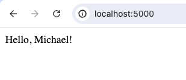

# Authorize app

1) Start the flask app from `meeting_mate/server/server.py``
2) Navigate to [localhost:5000](http://localhost:5000/)
3) Click on the link to initiate the authentication
4) After the successful oauth flow, you should be back at the home page and geeted with your user name rather than the auth link.

