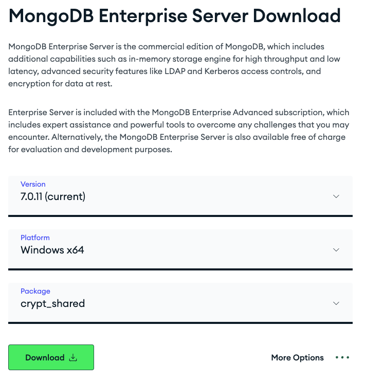

# Project set-up / pre-reqs
To get started, make sure you have a MongoDB Atlas cluster available. Sign up [here](https://account.mongodb.com/account/register) for free and create a free M0 cluster. We will also be working with [MongoDB Compass](https://www.mongodb.com/products/tools/compass) to inspect data in the database. You can download and use it to confirm that your IP access list is set up correctly and your applications can connect to the database.

The final download is the crypt-shared library required for client-side encryption with MongoDB. Navigate to the [download section](https://www.mongodb.com/try/download/enterprise-advanced) on the MongoDB Enterprise Advanced section and download the crypt-shared library. We will use it in the very first part of the workshop.



From the "MongoDB Enterprise Server Download" section, select the latest version, your client Platform (in this case - your workstation's OS) and "crypt_shared" for package.

## Used APIs and services
We're going to focus on User Sign on via Google Oauth and access the user's drive/docs in the Google Suite. For those who would like to follow along - you'll have to sign up on Google Cloud and configure Oauth consent screen & API access in the [Google API dashboard](https://console.cloud.google.com/apis/dashboard).

We're going to run a minimalistic, subjective/empirical model shootout using various model providers. For this portion, we are going to use [OpenAI](https://platform.openai.com/), [Anthropic](https://console.anthropic.com/), [Cohere](https://dashboard.cohere.com/), [Mistral](https://console.mistral.ai/) and finally [Fireworks.AI](https://fireworks.ai/)

The latter will be used for the majority of this workshop and serve as the primary endpoint for generating embeddings, doing chatcompletions or calling functions. If you wish to code along, [Fireworks](https://fireworks.ai/) is advisable. Given the nature of Langchain you could use other endpoints available to you, but experience and results might deviate from what we're showing. 

## .env file
For our project to work correctly, the root folder should contain a `.env` file with a number of variables.

```
cp .env_example .env
```

```
# MongoDB related
mongo_uri=<your mongodb connection string>
mongo_db=<database name>
mongo_crypt_shared_path=<path to the crypt shared library>

# Google auth related - 
google_client_id=<google client id>
google_client_secret=<client secret>

# api keys
fireworks_api_key=
openai_api_key=
anthropic_api_key=
cohere_api_key=
mistral_api_key=

PYTHONPATH=<absolute path to your project>/meeting-mate
```

Make sure you have PYTHONPATH in your `.env` file, otherwise python modules might not work as expected.

Further, if you want the jupyter notebooks to run in any other directory than root:

* Open VSCode settings
* Search for "notebook file root"
* Set "Jupyter: Notebook File Root" to `${workspaceFolder}` 

This will allow you to load .env files, keys and so on from the root folder

---

# Getting started with the project

Links to individual set-up steps and their corresponding guides:

1. [Set up Google for OAuth](./docs/google.md) - there are a few prerequisites for your app to authenticate users. We walk over the basics in this document.
2. [Bootstrapping CSFLE](./docs/csfle.md) - This is where we set up client-side field level encryption to ensure sensitive user access tokens can't be stolen from your database.
3. [Obtaining the user token](./docs/auth.md) - We make use of the Google APIs to implement an authentication flow, retrieve user information and store access tokens.
4. [Retrieving data](./docs/crawling.md) - Making use of Google SDK, we crawl owned & shared documents for every user (including update crawls) and retrieve his documents
5. [Fact extraction](./docs/conversion.md) - We pre-process documents, chunk, extract facts & entities, apply clustering, create embeddings and more.
6. [RAG](./docs/rag.md) - We configure Atlas Search and run the demo app.

During the workshop, we will be able to import Json data allowing you to follow along even if the previous steps didn't work for you, you don't have access to LLMs/inference APIs and so on.